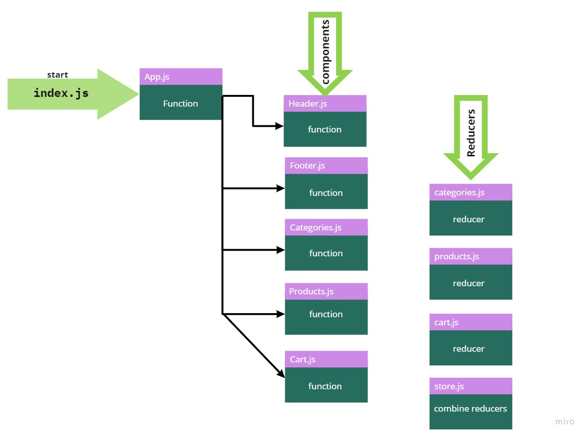

## Store

### Reqiurements
- Phase 3 Requirements
In phase 3, we will be connecting our Virtual Store to a live API so that our data is persistent and able to be separately managed.

    - As a user, I want to interact with live inventory so that I have confidence that the displayed products are in stock
    - As a user, I want to know to that when I add an item to my cart, that it is removed from inventory so that no other users can purchase it.
    
### links
- Deployed link on Netlify: https://haneen-store.netlify.app/ 

### UML
