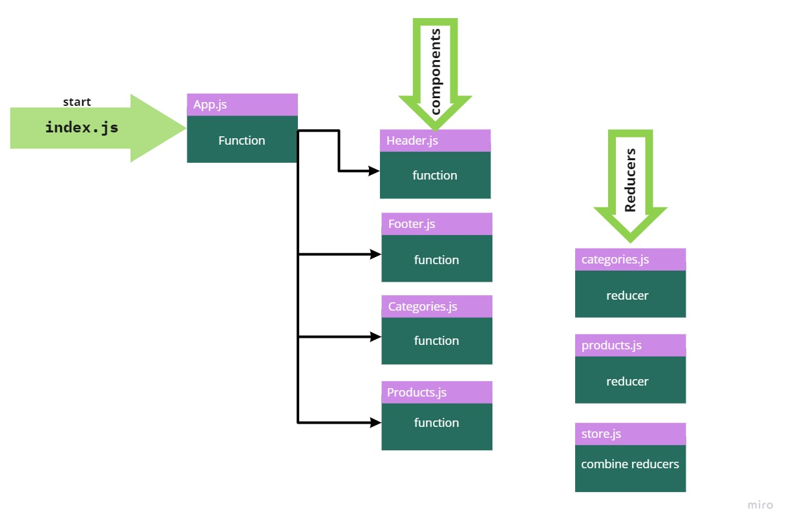

## Store

### Reqiurements
- Phase 1 Requirements
The following user/developer stories detail the major functionality for this phase of the project.
    - As a user, I expect to see a list of available product categories in the store so that I can easily browse products
    - As a user, I want to choose a category and see a list of all available products matching that category
    - As a user, I want a clean, easy to use user interface so that I can shop the online store with confidence

### links
- Deployed link on Netlify: https://haneen-store.netlify.app/ 

### UML
